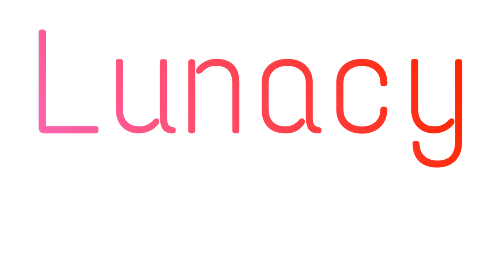

<p align="center">
  

  ____________

Lunacy — server software for Minecraft Bedrock Edition, built on top of PocketMine-NetherGames.
Our modification runs on PHP language, version 8.1+, and also supports all new versions of Minecraft Bedrock from 1.20.0 up to 1.26.

❗️This project is licensed under GPL-2.0. Please see the LICENSE file for details.
Lunacy are not affiliated with Mojang. All brands and trademarks belong to their respective owners. Lunacy is not a Mojang-approved software, nor is it associated with Mojang.

---

## Installing our modification:

### Windows (recommended)

1) Install dependencies:

```powershell
composer install
```

(If Composer is not in PATH, use `.\composer.ps1 install`.)

2) Start the server from **source**:
- `start.bat` (regular start)
- `start.ps1 -Loop` (restart loop after shutdown)

3) **PocketMine-MP.phar** (single file, optional):

```powershell
composer install --no-dev
```

This creates **`PocketMine-MP.phar`** in the project root. Run it with **`start_phar.bat`** (uses `bin\php\php.exe` if present).

> `vendor/` is **not** stored in Git — run `composer install` after clone. The `.phar` file is not committed (`*.phar` in `.gitignore`); build it locally or attach to [Releases](https://github.com/karepanov35/Lunacy/releases).

### Linux / macOS

1) Install dependencies:

```bash
composer install
```

2) Start (if you’re using the `phar` build):

```bash
chmod +x start.sh
./start.sh
```

> Note: in this repository, the Windows launcher runs from source (`src/PocketMine.php`). The Bash script expects `PocketMine-MP.phar` by default.

---


Additional links:

[](https://vk.ru/lunacydev)
[](https://vk.ru/lunacydev)
